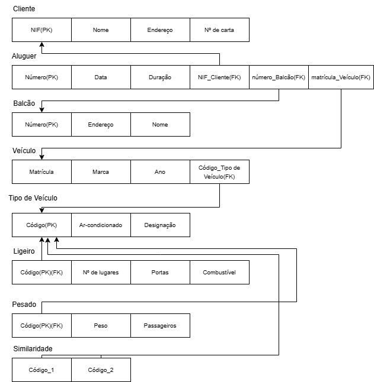
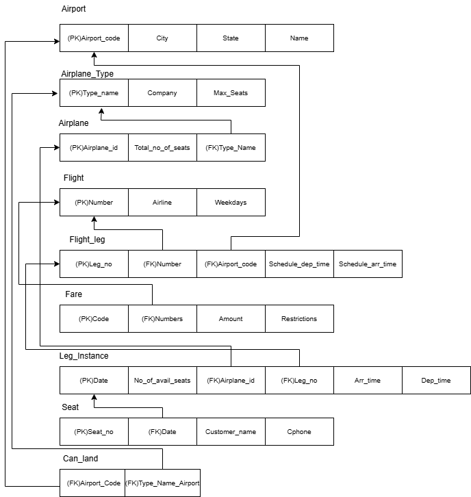
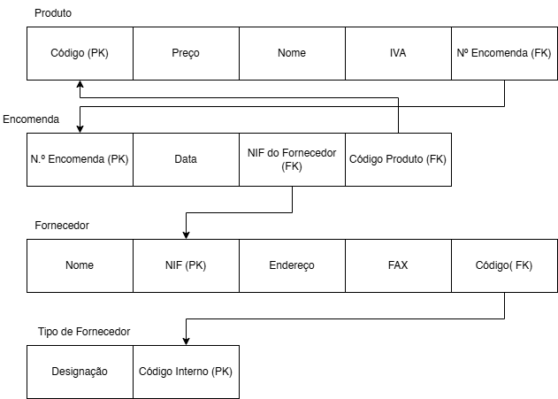
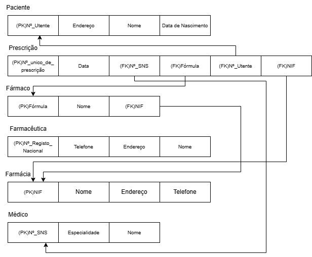
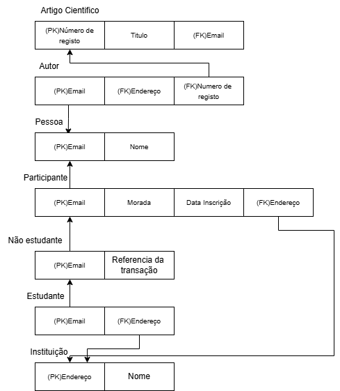
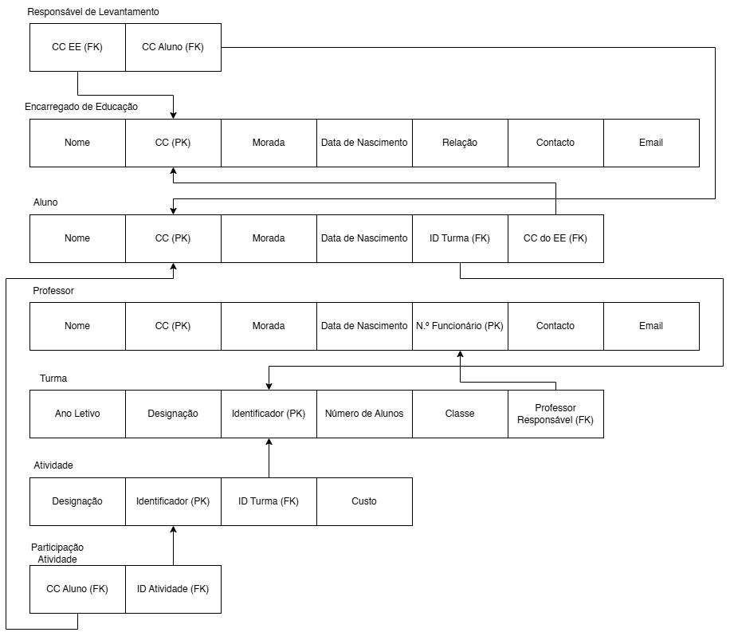

# BD: Guião 3


## ​Problema 3.1
 
### *a)*

```
Cliente - NIF, nome, endereço, nº de carta
Aluguer - número, data, duração
Balcão - número, endereço, nome
Veículo - matrícula, marca, ano
Tipo de Veículo - código, ar-condicionado, designação
Ligeiro - nº lugares, portas, combustível
Pesado - peso, passageiros
Similaridade - código_1, código_2

```


### *b)* 

```
Cliente - chaves candidatas:NIF, nº de carta
        - chaves primárias: NIF
        - chaves estrangeiras: 

Aluguer - chaves candidatas: número
        - chaves primárias: número
        - chaves estrangeiras: NIF_Cliente, número_Balcão, matrícula_Veiculo

Balcão - chaves candidatas: número
       - chaves primárias: número
       - chaves estrangeiras:

Veículo - chaves candidatas: matrícula
        - chaves primárias: matrícula
        - chaves estrangeiras: código_Tipo de Veículo

Tipo de veículo - chaves candidatas: código
                - chaves primárias: código
                - chaves estrangeiras: 

Ligeiros - chaves candidatas: código
         - chaves primárias: código
         - chaves estrangeiras: código

Pesados - chaves candidatas: código
        - chaves primárias: código
        - chaves estrangeiras: código
Similardades - chaves candidatas: código
             - chaves primárias: código
             - chaves estrangeiras: código
```


### *c)* 




## ​Problema 3.2

### *a)*

```
Airport - Airport_code, City, State, Name
Can_land - Airpot_Airport_code,  Airplane_Type_Type_name
Airplane_type - Type_name, Max_seats, Company
Airplane - Airplane_id, Total_no_of_seats, Airplane_Type.Type_name
Flight_leg - Leg_no, Flight_NUmber, Schedule_dep_time, Airport_code, Schedule_arr_time
Flight - Number, Airline, Weekdays
Fare - Flight_Number, Code, Amount, Restrictions
Leg_instance - Date, No_of_avail_seats, Airplane_id, Leg_no, Arr_time, Dep_time
Seat - Seat_no, Costumer_Name, Date, Cphone

```


### *b)* 

```
Airport - chaves candidatas: Airport_code, Name
        - chaves primárias: Airport_code
        - chaves estrangeiras: 

Can_land - chaves candidatas: Airpot_Airport_code,  Airplane_Type_Type_name
        - chaves primárias: 
        - chaves estrangeiras: Airpot_Airport_code,  Airplane_Type_Type_name

Airplane_type - chaves candidatas: Type_name
       - chaves primárias: Type_name
       - chaves estrangeiras:

Airplane - chaves candidatas: Airplane_id
        - chaves primárias: Airplane_id
        - chaves estrangeiras: Airplane.type_Type_name

Flight_leg - chaves candidatas: Leg_no
                - chaves primárias: Leg_no
                - chaves estrangeiras: Flight_Number, Airport.Airport_code

Flight - chaves candidatas: number
         - chaves primárias: number
         - chaves estrangeiras: 

Fare - chaves candidatas: Code
        - chaves primárias: Code
        - chaves estrangeiras: Flight_number

Leg_instance - chaves candidatas: Date
             - chaves primárias: Date
             - chaves estrangeiras:  Airplane.Airplane_id ,Flight_Leg.Leg_no, Airport.Airport_code

Seat - chaves candidatas: Seat_no
        - chaves primárias: Seat_no
        - chaves estrangeiras: Leg_instance.Date
```


### *c)* 




## ​Problema 3.3


### *a)* 2.1



### *b)* 2.2



### *c)* 2.3



### *d)* 2.4

